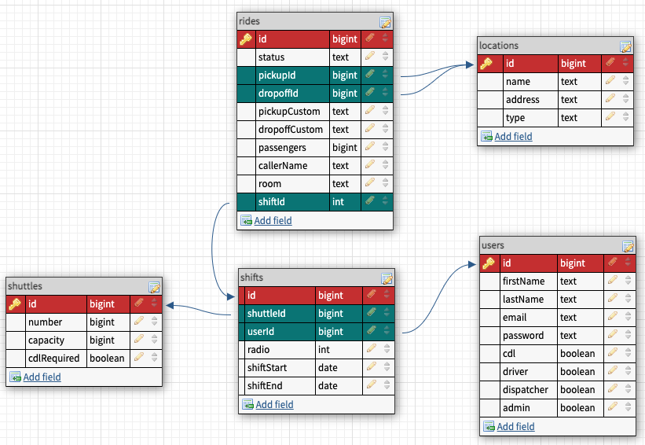

# Dispatched
> This project is designed to be used by lodging companies for the purpose of organizing and managing their fleet, drivers, and riders. The goal of this application is to simplify ride services and to provide useful insights into rider demand.

## Technologies
> Front-end
- React
- React Native
- Node.js
- Material-UI
- D3
> Back-end
- Express
- PostgresQL
- Node.js
- Socket.io

## User Stories
- Web App
    - An employee will create an account and provide basic job specific information.
    - Each employee will have a Profile containing basic information such as email, phone, license, and role. Certain fields will have to ability to be edited by the employee while all fields can be edited by an Administrator.
    - The Location Creation Page will contain a list of all locations including properties, restaurants, shops, attractions. These items will be displayed on the Dispatch Dashboard. On this page will be a form to create a new location as well as edit or delete an existing location. Only Administrators and Dispatchers will have access to this page.
    - A Dispatcher/Administrator will have access to the Dispatch Dashboard where they can create, edit, delete rides and dispatch them to active drivers. The status of rides will be updated by Driver's through the mobile app and displayed in the dashboard. A list of properties and other locations will be displayed for easy ride-creation. A sidebar will contain pending rides and completed rides for the session. A separate page will hold a map containing popular destinations and live shuttle locations.
    - Administrators will have access to the Administrator Dashboard. This page will display an overview of ride statistics, a fleet list, and employee list.
- Mobile App
    - A Driver will use the Login View to login with their credentials, as well as provide their shuttle number, radio number, and loop at the start of a shift.
    - The Driver will then see the Working View. As rides are dispatched, the Ride details will display in Pending Rides. Once accepted, Ride Details will move to Accepted Rides where a ride can be set to rolling, clear, or no-show. Once a ride is complete, Ride Details for that ride will be moved to Completed Rides.
    - Each step of the ride will be sent to and seen on the Dispatch Dashboard.

## ERD

## Wire-frames

> The web application will be used by all employees in the company. This is where an employee can create and edit a profile. Employees will be designated one or multiple roles. These roles include: Administrator, Driver, Dispatcher. Each role has different permissions granted to them.

> Summary of Features:
See User Stories section above

> The mobile application will be used by all Drivers in the company. This is where a Driver can login during their shift to receive, accept, and complete rides. 

> Summary of Features:
See User Stories section above

## MVP
- [] Web Application
    - [] Employee CRUD
        - [] Signup
        - [] Login
            - [] Driver login
            - [] Dispatcher login
        - [] Profile
        - [] Edit
        - [] Delete
    - [] Location CRUD
        - [] Create
        - [] Edit
        - [] Delete
        - [] Read all
    - [] Dispatch Dashboard
        - [] Location lists
            - [] Seed locations
            - [] Properties
            - [] Destinations
        - [] Rides
            - [] Create
            - [] Edit
            - [] Ride Details
        - [] Active Drivers Dashboard
            - [] Driver Card
        - [] Ride Summary Aside
            - [] Pending Rides List
            - [] Completed Rides List

- [] Mobile Application
    - [] Driver login
    - [] Working View
        - [] Shift Details
        - [] Ride Details
        - [] Accepted Rides
        - [] Pending Rides
        - [] Completed rides

- [] Driver-Dispatcher Connection
    - [] Logged in driver is displayed on Dispatch Dashboard
    - [] Rides are sent to driver and displayed
    - [] Ride status can be changed by driver and displayed in the Dispatch Dashboard

## Stretch Goals
- [] Administrator Dashboard
- [] Employee Profile View
    - [] Schedule
    - [] Request Time-off
- [] Live Map
    - [] Display locations
    - [] Display live shuttle locations 

## Timeline
*7 DAYS TO COMPLETE MVP*

- Day 1
    - Web App
        - Employee CRUD
        - Deploy
            - Auto update
- Day 2-3
    - Web App
        - Location CRUD
        - Dispatch Dashboard
            - Create components
            - Seed locations
- Day 4
    - Web App
        - Dispatch Dashboard *
- Day 5-6
    - Mobile App *
- Day 6-7
    - Driver-Dispatcher Connection *
- Ongoing
    - Reach full functionality described
    - Stretch goals

## Foreseen Challenges
- This is a big project. Significant bugs will have a big impact on the timeline.
- This will be my first time using Socket.io and React Native. I will need to adhere to the schedule and make changes as necessary.
- Storing and sharing information will greatly impact the functionality of the app. Meaning stored information needs to change as little as possible as it will effect the functionality of many components.

## Component Tree
- WebApp
    - Login/Signup View
        - Login Form
        - Signup Form
    - Employee Profile View
        - Edit User Form
    - Location Creation View
        - Location List
        - Create Location Form
        - Edit Location Form
    - Dispatch Dashboard View
        - Create Ride Form
        - Edit Ride Form
        - Active Drivers Dashboard
            - Driver Card
                - Ride Details
        - Location Lists
            - Location Card
        - Ride Summary Aside
            - Pending Rides List
            - Completed Rides List
    - Shuttle and Location Map View
    - Administrator Dashboard View
        - Ride Stats Container
        - Fleet List
        - Employee List

- MobileApp
    - Login View
        - Login Form
    - Working View
        - Shift Details
        - Accepted Rides
            - Ride Details
        - Pending Rides
            - Ride Details
        - Completed rides
            - Ride Details

## Route Inventory
| Method | Endpoint | Description |
| --- | --- | --- |
| POST | /user | Signup/Create user |
| GET | /user | Get all users |
| POST | /user/login | Login/Authenticate user |
| GET | /user/verify | Authenticate user |
| PUT | /user/:userId | Update user |
| DELETE | /user/:userId | Delete user |
| --- | --- | --- |
| GET | /location | Get all locations |
| POST | /location | Create location |
| PUT | /location/:locationId | Update location |
| DELETE | /location:locationId | Delete location |
| --- | --- | --- |
| POST | /ride | Create ride |
| PUT | /ride/:rideId | Update ride |
| DELETE | /ride/:rideId | Delete ride |
| --- | --- | --- |
| GET | /shift | Get active employees |
| --- | --- | --- |
